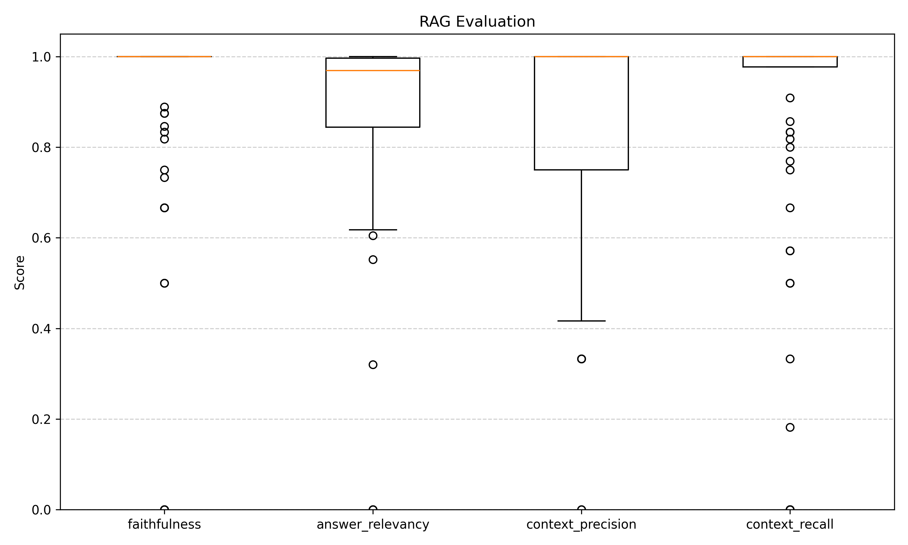
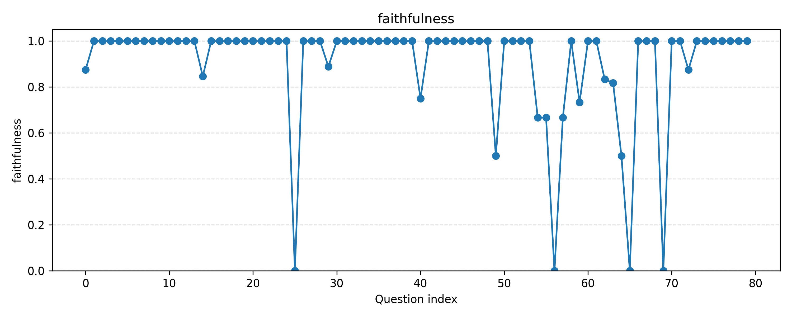
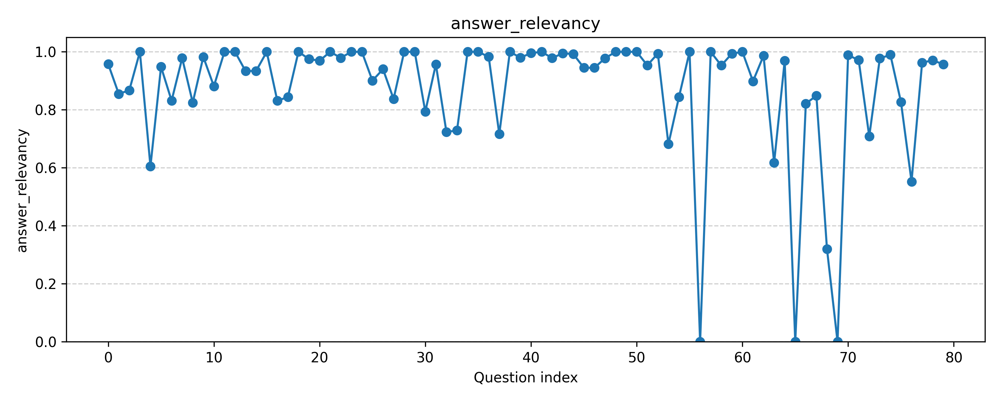
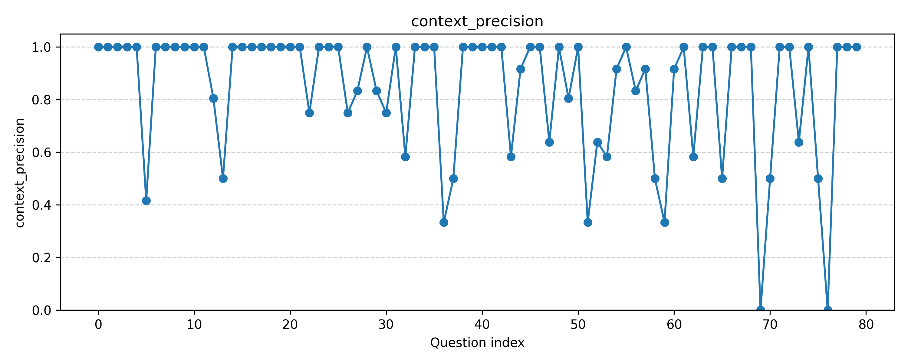
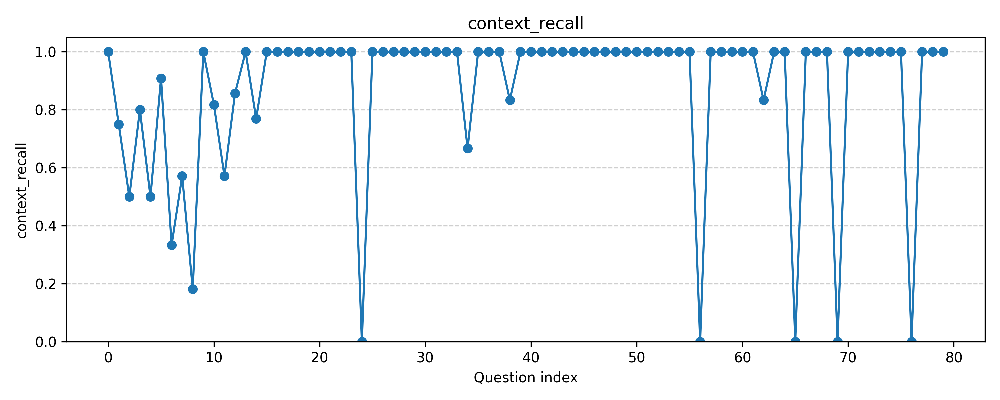

# 📝 RAG-Thesis-Chatbot

This repository contains a Retrieval-Augmented Generation (RAG) project — an interactive question-answering chatbot answering questions about my master thesis:

> Performance Evaluation of Tools for Automatic Processing of Polish L2 Interlanguage

The goal of this project is to preprocess a LaTeX thesis, convert it into a clean, LLM-friendly format, build a RAG system with vector embeddings, and evaluate its performance.

### 📌 Project Overview – What Is Implemented

The project is organized into 3 stages:

**1. Thesis Preprocessing**
- LaTeX cleanup and conversion to Markdown(`prepare_rag_source.py`)
- Corpus Noise Cleaning (`clean_noise.py`)

**2. RAG Pipeline (`main.py`)**

**3. Evaluation:**
- Question and Answer Generation (`generate_questions.py`)
- Evaluation (`evaluation.py`)
- Visualization(`evaluation_visualization.py`)


### 🔧 Tools and Components Used

**LaTeX Preprocessing:**
- Python (custom macro replacement, TIPA → IPA conversion)
- Pandoc (LaTeX → Markdown conversion)

**Document Structuring and Chunking:** LangChain (MarkdownHeaderTextSplitter, RecursiveCharacterTextSplitter)

**Embeddings:** OpenAI Embeddings API

**Vector Store:** ChromaDB

**Retrieval and Ranking:** Chroma similarity search

**Generation (Answering Questions):** OpenAI LLM (`gpt-4o-mini`), Anthropic Claude LLM (`claude-opus-4-5-20251101`)

**Evaluation:** RAGAs

## Part 1: Preparing Thesis Documents for RAG

The chatbot relies on RAG to ground its answers in the content of the thesis. Before this can happen, the thesis must be converted into a clean, LLM-friendly format.

### Why Is Preprocessing Needed?

The thesis includes a phonetic analysis of Polish L2 interlanguage, which contains extensive IPA (International Phonetic Alphabet) notation. These IPA symbols were originally written in LaTeX using the TIPA package.

However, document-conversion tools cannot interpret these macros directly, leading to broken Unicode characters or empty placeholders in the output. The preprocessing pipeline converts macros into proper Unicode IPA symbols and removes noise.

### `prepare_rag_source.py`

This script performs:

**1. External macro replacement**
Expands custom LaTeX macros into plain Unicode characters.

**2. TIPA phonetic transcription conversion**
Extracts `\textipa{...}` blocks and converts TIPA to clean IPA.

**3. Pandoc conversion to Markdown**
Generates `main_with_noise.md` and places the file into `data/intermediate/`.

* Copies bibliography (`biblio.bib`) to `data/final/`.


### `clean_noise.py`

The script cleans markdown noise – removes extraneous elements that may interfere with embeddings and LLM processing:
- Curly-brace blocks `({...})`
- Internal Markdown links
- Images with attributes
- Parenthesized references
- LaTeX math blocks `($$ ... $$)`
- Footnotes
- LaTeX figure/app labels `(\[fig:...\])`

The script produces a clean, RAG-ready Markdown file (`main.md`) in `data/final/` and saves a noise inventory JSON for reference.


## Part 2: Chunking, Vectorization and Question Answering

### `main.py`

This script implements the full RAG pipeline:

**1. Markdown-based Document Splitting:**
Uses header hierarchy (`#`, `##`, `###`, `####`) to create structured sections.

**2. Recursive Chunking:**
Chunks each section into smaller pieces (2000 characters, 200 overlap).

**3. Header metadata boosting:**
Header paths are prepended to each chunk to improve embedding relevance.

**4. Vector Store Creation:**
Creates a Chroma vectorstore using OpenAI embeddings.

**5. RAG-based Question Answering:**
- User provides a question via CLI.
- The system performs similarity search in ChromaDB to retrieve top-k chunks.
- Concatenates retrieved context and passes it to OpenAI LLM (`gpt-4o-mini`) for answer generation.
- Citations are automatically replaced with (Author, Year) format based on `.bib` entries.
- Returns answer.

## Part 3: Evaluation

### `generate_questions.py` 

The script produces high-level evaluation questions using Claude LLM:

First, produces approximately 15 high-level, conceptual questions with complete answers based on the thesis. These questions focus on:
- Research goals & motivation
- Theoretical background
- Methodology
- Data used
- Findings & conclusions
- Limitations & future work

Next, using the same script, a second set of approximately 50 shorter and more detailed questions is generated. These questions target more specific aspects of the thesis and vary in length and level of detail.

All outputs are saved in JSON format.

Finally, a final evaluation dataset is created by combining different types of questions and answers (varying in length, specificity, and level of abstraction), which is then used for systematic RAG evaluation.

### `evaluation.py`

- Loads evaluation questions and ground truths.
- Runs each question through the RAG pipeline.
- Collects responses and contexts.

Evaluates the dataset using metrics:
- **faithfulness** – correctness relative to the context,
- **answer_relevancy** – relevance of the answer to the question,
- **context_precision** – fraction of retrieved context that is relevant,
- **context_recall** – fraction of relevant context retrieved.

### `evaluation_visualization.py`

Generates boxplots for all metrics and line plots showing metric scores per question.

## 📊 Evaluation Results

The RAG system was evaluated on a set of 80 questions. The first 15 questions were more open-ended and required more elaborate, descriptive answers, while the remaining questions were more concise and specific, often targeting concrete details from the thesis.



A small number of failure cases (0.0 scores) were observed, typically corresponding to answers stating that the question was unrelated to the thesis context. These cases likely stem from retrieval issues during context generation and will be addressed in future work.

### Faithfulness

The model achieves consistently high faithfulness, suggesting that generated answers are largely grounded in the retrieved context and hallucinations are rare.



### Answer Relevancy

Answer relevancy is generally high, indicating that the generated answers effectively address the questions.



### Context Precision

The retrieval component shows relatively high context precision, meaning that most retrieved chunks are relevant to the generated answers. Occasional drops in precision are expected due to the use of relatively large chunks (2000 tokens) and a retrieval setting of k = 4, which was a deliberate design choice to reduce the risk of missing important information.



### Context Recall

Similarly, context recall is high for most questions, indicating that the retriever usually provides sufficient information to answer the question. Lower recall values occur for complex, multi-aspect questions (at the beginning), where capturing all relevant details is inherently more challenging.




#### 🗂️ Folder organization

```
RAG_chatQA/
│
├─ data/
│  │
│  ├─ raw/           # Original LaTeX thesis and bibliography (modele.tex, page-de-garde.tex, documentation.tex, biblio.bib)
│  ├─ intermediate/  # Cleaned intermediate LaTeX file with IPA macros replaced (cleaned_ipa.tex) and main_with_noise.md
│  └─ final/         # Final markdown files ready for RAG (main.md, biblio.bib)
│
├─ chroma/           # Chroma vectorstore directory
│
├─ scr/
│  ├─ prepare_rag_source.py  # Preprocessing LaTeX → Markdown
│  ├─ clean_noise.py          # Noise removal
│  ├─ main.py                 # RAG pipeline (chunking, vectorstore, QA)
│  ├─ generate_questions.py   # Automatic QA generation
│  ├─ evaluation.py           # RAG evaluation
│  └─ evaluation_visualization.py  # Visualization of metrics
```

### ⚙️ Installation

1. Clone the repository:

```
git clone git@github.com:agataskrzyniarz1/RAG_chatQA.git
cd RAG_chatQA
```

2. Install Python dependencies:

```
pip install -r requirements.txt
```

3. Install Pandoc for LaTeX → Markdown conversion:

```
sudo apt install pandoc
```

4. Set your OpenAI API key:

```
export OPENAI_API_KEY="your_api_key_here"
```

5. Set your Anthropic API key (for generating evaluation questions):


```
export ANTHROPIC_API="your_api_key_here"
```

Alternatively, if the variable is not set, the script will ask you to enter the key interactively at runtime.

### ▶️ Usage

1. Prepare thesis source:

```
cd scr
python prepare_rag_source.py
python clean_noise.py
```

2. Run RAG QA:

```
python main.py "What are the main objectives of the thesis?"
```

3. Generate evaluation questions

```
python generate_questions.py
```

4. Evaluate RAG

```
python evaluation.py
python evaluation_visualization.py
```


### ⚠️ About the Data ⚠️

This repository does not include my full thesis as it is not **yet** published, so the raw content is intentionally omitted for copyright reasons.

The `data/` directory will be uploaded as soon as the thesis is published.

### 🚀 Next step: a web UI for interactive QA.